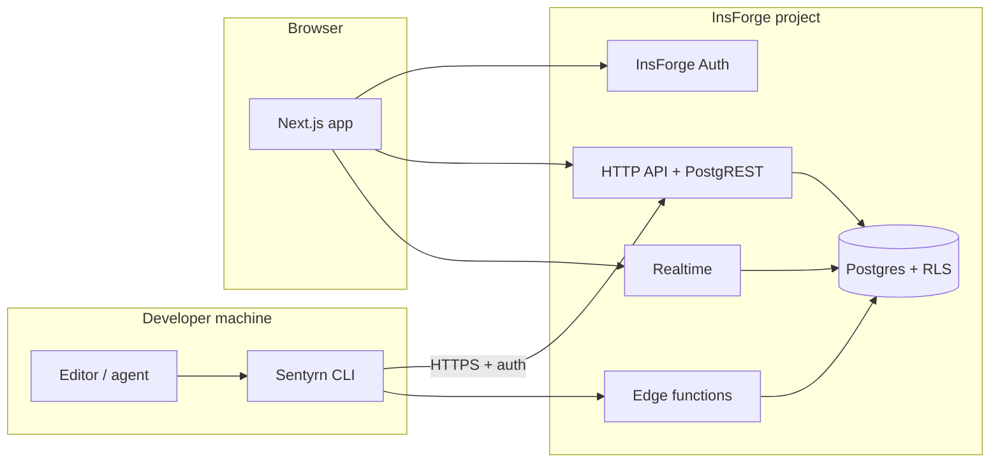

# Sentyrn — Architecture (MVP)

High-level architecture for the **web app**, **InsForge backend**, and **CLI**. This is a specification: implementation details belong in code and later ADRs.

---

## Goals

- **Replayable** session history with clear ordering and idempotent ingestion.
- **Multi-tenant** workspaces with strong isolation (RLS everywhere tenant data lives).
- **Least privilege**: browser never holds service-role keys; secrets server-side only.
- **Extensible adapters**: Cursor, Claude Code, Codex attach to the same event pipeline.

---

## System context



---

## Components

### 1. Next.js (App Router) web application

- **Framework:** Next.js, TypeScript, Tailwind CSS, shadcn/ui (per PRD).
- **Validation:** Zod at API boundaries and for forms.
- **Auth session:** Server-centric session handling; **httpOnly, Secure cookies** — no long-lived tokens in `localStorage` (see security-model.md).
- **InsForge client:** `@insforge/sdk` with **anon key** in public env only; privileged operations use server routes or edge functions, never exposed service keys.

### 2. InsForge backend

| Capability | Use in Sentyrn |
|------------|----------------|
| **Postgres** | Canonical store for workspaces, sessions, events, findings, policies, audit logs. |
| **Auth** | User identity; JWT for RLS; device / CLI token model layered per database-schema.md. |
| **Functions** | Ingestion validation, redaction enforcement hooks, webhooks later (GitHub App phase). |
| **Realtime** | Live session / replay updates where latency matters; optional for MVP if phased. |
| **Deployment** | InsForge-managed frontend deploy path per PRD. |

All tenant-owned tables **must** use RLS; see security-model.md.

### 3. Sentyrn CLI (Node, TypeScript, `npx`)

- **Distribution:** `npx sentyrn …` (package name TBD in publishing; command surface in cli-spec.md).
- **Responsibilities:** Authenticate device/user, open/close sessions, watch workflow, redact, stream events to backend.
- **No silent exfiltration:** Behavior governed by privacy mode and org policy.

---

## Major data flows

### A. CLI → backend ingestion

1. CLI obtains **device-scoped** or **user-scoped** credential (see security-model.md).
2. CLI emits **versioned events** (batch or stream) to an ingestion endpoint (REST or function — finalized in Phase 2 implementation plan).
3. Server validates schema, applies **server-side redaction** pass, persists append-only events, derives findings asynchronously or inline per product decision.

### B. Web app → backend reads

1. User authenticates via InsForge Auth (browser cookie session pattern per Next.js + InsForge docs).
2. Dashboard queries only rows allowed by RLS for that user’s workspace membership.

### C. Realtime (optional in early MVP)

- Channels scoped by workspace/session IDs with RLS on realtime tables per InsForge patterns.
- Subscribe only after channel patterns exist in backend configuration.

---

## Repository layout (target)

Not created in Phase 0; agreed direction for Phase 1+:

```text
apps/web/          # Next.js application
packages/cli/      # sentyrn CLI (publishable)
packages/shared/   # Shared types, Zod schemas (telemetry + API)
```

Adjust in an ADR if monorepo tool (pnpm/turborepo) is chosen.

---

## Non-goals (architecture)

- Running the full agent inside Sentyrn.
- Treating InsForge **API key** as a browser-accessible key (forbidden).
- Bypassing RLS with service role from the client bundle.

---

## Dependencies on external docs

- **InsForge SDK** — client patterns: `createClient`, env prefixes for Next.js (`NEXT_PUBLIC_INSFORGE_*`).
- **InsForge CLI** — `npx @insforge/cli` for link, migrations, metadata, secrets; never global install.

---

## Open decisions (to close in Phase 1–2 ADRs)

1. **Ingestion transport:** REST vs edge function vs both; batching and backoff.
2. **Idempotency keys** for event batches (CLI-generated UUIDs per batch).
3. **Realtime scope** for MVP vs Phase 4 cut line.
4. **CLI auth mechanism:** PAT vs device flow vs OAuth device code — must satisfy security-model.md.
